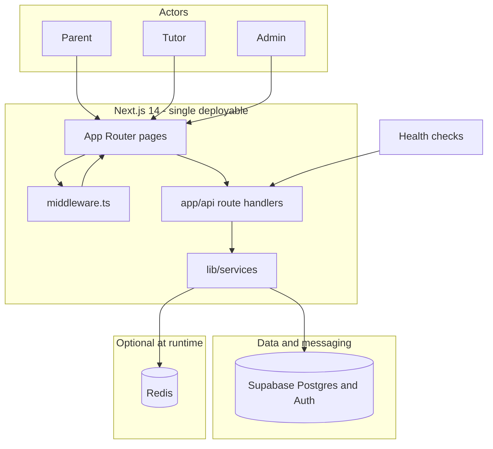

# Tutor-Link

Tutor-Link is a full-stack web application that connects parents with tutors for in-home tutoring. The backend is implemented as **one deployable Next.js 14 app** (modular monolith): HTTP endpoints live under `app/api`, business rules live under `lib/services`, and data plus authentication are provided by **Supabase** (PostgreSQL and Supabase Auth, including email OTP). Optional **Redis** backs **server-side rate limiting** when `REDIS_URL` is set so limits stay consistent across multiple instances.

**Live demo:** https://wikin-tich.vercel.app/

---

## Architecture

The browser talks to a single Node process that serves both the React UI (App Router) and JSON API routes. **`middleware.ts`** adds security headers and protects dashboard routes with a lightweight session check; **CSRF validation, sanitization, validation, and rate limiting** for state-changing APIs run inside **`app/api`** handlers, which call **`lib/services/*`** modules. **Supabase** holds application data and auth users; **Redis** (when configured) participates in rate limits. **`GET /api/health`** returns process and dependency status for monitoring (it intentionally skips CSRF and rate limits).



---

## Tech stack

| Area | Technology |
|------|------------|
| Language | TypeScript (strict) |
| Runtime | Node.js — **20** in Docker; **18+** acceptable for local dev |
| Web framework | Next.js 14 (App Router), React 18 |
| Styling | Tailwind CSS |
| Database and auth | Supabase (PostgreSQL, Row Level Security, Supabase Auth) |
| Caching and limits | **ioredis** when `REDIS_URL` is set; otherwise Postgres / in-memory fallback per `lib/server-rate-limiting.ts` |
| Security | HMAC CSRF cookies, server-side validation and sanitization, security headers, bcrypt where used |
| Testing | Jest, Testing Library |
| Container | Multi-stage **Dockerfile** (`output: 'standalone'`); **docker-compose** with **app**, **Redis**, and **Caddy** on host port **80** |

---

## Repository layout (backend-relevant)

- `app/api/` — HTTP handlers (thin); call into `lib/services`
- `lib/services/` — Business logic (CSRF, rate limits, health, registration, matching, etc.)
- `lib/` — Shared utilities, constants, Supabase helpers, security validators
- `middleware.ts` — Security headers and dashboard route protection (Edge-compatible session parse)

---

## Prerequisites

- **Node.js** 18+ (20 recommended to match the Docker image)
- **npm** 9+
- A **Supabase** project with email/OTP auth enabled
- **Git** and a modern browser
- **Docker Desktop** (or compatible engine) only if you use `docker compose`

---

## Environment variables

Copy `.env.example` to `.env.local` for local development (Next.js loads `.env.local` automatically). For Docker Compose, copy to `.env` or pass `--env-file .env.local` as noted below.

| Variable | Required | Purpose |
|----------|----------|---------|
| `NEXT_PUBLIC_SUPABASE_URL` | Yes | Supabase project URL |
| `NEXT_PUBLIC_SUPABASE_ANON_KEY` | Yes | Supabase anon (public) key |
| `SUPABASE_SERVICE_ROLE_KEY` | Yes | Service role key for trusted server operations |
| `CSRF_SECRET` | Yes | Secret for signing CSRF cookies |
| `SESSION_SECRET` | Yes | Secret for session signing |
| `REDIS_URL` | No | When set (e.g. `redis://redis:6379` in Compose), server rate limits use Redis |
| `GIT_SHA` | No | Shown in `/api/health` when set (e.g. Docker build arg) |
| `PRODUCTION_URL`, `STAGING_URL`, `NEXT_PUBLIC_SITE_URL`, `ADDITIONAL_ALLOWED_ORIGINS` | No | Origins and redirects — see `lib/cors-config.ts` |

Never commit real secrets. See `.env.example` for full comments.

---

## Run locally (development)

```bash
git clone https://github.com/es-protocol/wikinTich.git
cd wikinTich
npm install
```

Create `.env.local` from `.env.example` and fill in Supabase and secrets, then:

```bash
npm run dev
```

Open **http://localhost:3000**. To try flows end-to-end, use an email inbox that can receive Supabase OTP messages.

Without Docker, Redis is optional; rate limiting falls back to the database or in-memory behavior defined in code.

---

## Run with Docker Compose (production-style)

The stack runs **Caddy** on port **80** → **app:3000**, plus **Redis**. The Next.js container is not exposed directly on the host.

1. Provide env vars (at minimum the required keys above) in `.env` or `.env.local`.
2. From the project root:

   ```bash
   docker compose up --build
   ```

   If secrets live only in `.env.local`:

   ```bash
   docker compose --env-file .env.local up --build
   ```

3. Open **http://localhost** (port 80).

`REDIS_URL` is set inside Compose to `redis://redis:6379` so rate limits use Redis in this layout.

---

## Scripts

| Command | Description |
|---------|-------------|
| `npm run dev` | Next.js development server |
| `npm run build` | Production build |
| `npm run start` | Start production server (after `build`) |
| `npm run lint` | ESLint (Next.js config) |
| `npm run typecheck` | `tsc --noEmit` |
| `npm test` | Jest test suite |
| `npm run test:coverage` | Jest with coverage |

---

## Core product flows (summary)

- **Parent:** multi-step home-tutoring request → email OTP → account creation and dashboard.
- **Tutor:** application with profile and availability → OTP → tutor dashboard.
- **Admin:** dashboards for matching, requests, notifications, and related APIs under `app/api/admin/*`.
- **Matched users:** sessions and messaging via APIs under `app/api/parent/*`, `app/api/tutor/*`, and `app/api/messages/*`.

---

## Troubleshooting

- **Port in use:** `npx kill-port 3000` or `npm run dev -- -p 3001`.
- **Supabase / OTP:** confirm all three Supabase variables, project not paused, and email provider enabled in the Supabase dashboard.
- **CSRF or session errors:** set strong `CSRF_SECRET` and `SESSION_SECRET`, clear cookies, restart the dev server.
- **Build issues:** delete `.next`, reinstall dependencies with `npm ci` or `npm install`, then `npm run build` again.

---

## License

This project was created for educational and assessment purposes. It is not currently licensed for general reuse or commercial deployment.
