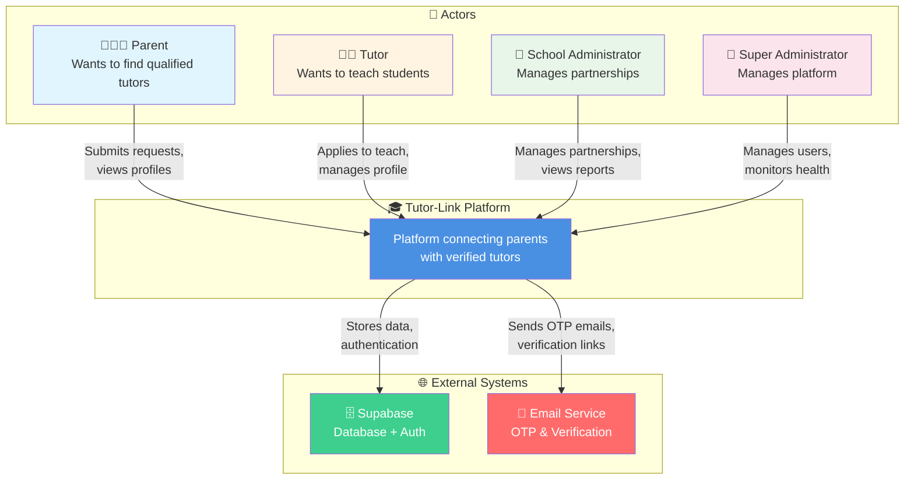
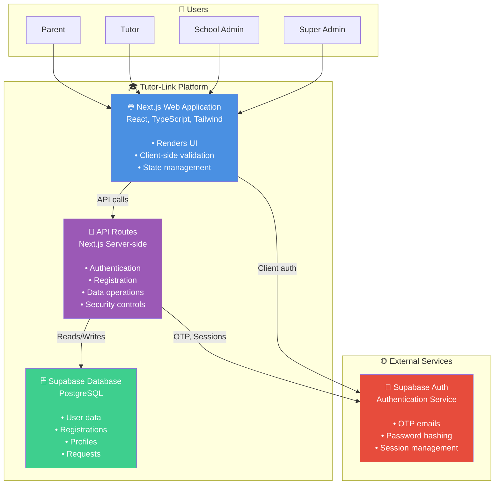
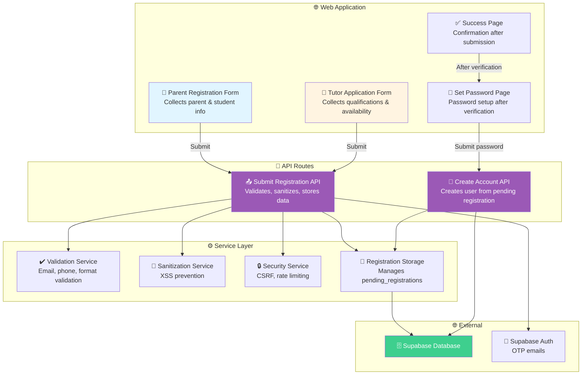
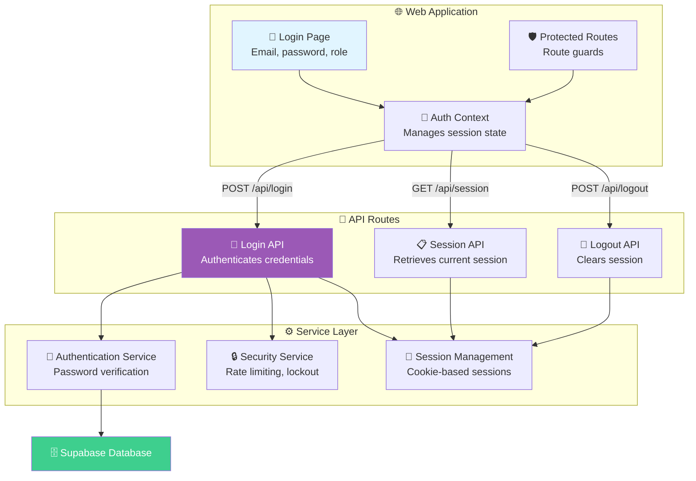
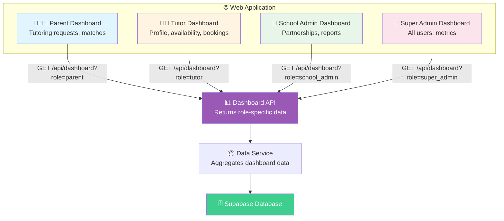
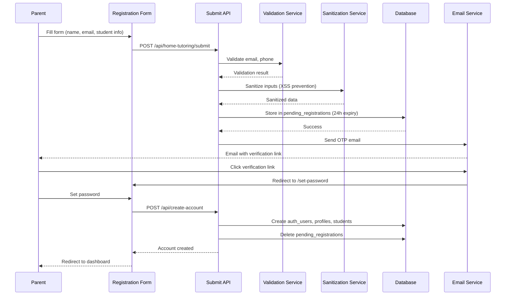

# Tutor-Link C4 Architecture Documentation
## (Standard Mermaid Syntax - Compatible with All Extensions)

This document provides a comprehensive C4 model architecture view of the Tutor-Link platform, using standard Mermaid syntax for maximum compatibility.

## Quick Fix for VS Code

1. **Open Markdown Preview**: Press `Ctrl+Shift+V` (Windows) or `Cmd+Shift+V` (Mac)
2. **Extension Needed**: Install "Markdown Preview Mermaid Support" by bierner
3. **Alternative**: Use [Mermaid Live Editor](https://mermaid.live) online

---

## System Context (Level 1)

The System Context diagram shows Tutor-Link in its environment, including all users and external systems.

### Diagram

### Description

**Actors:**
- **Parent**: Submits home tutoring requests, views tutor profiles, manages bookings
- **Tutor**: Applies to teach, completes verification profile, manages availability
- **School Administrator**: Manages school partnerships and tutor assignments
- **Super Administrator**: Manages platform operations, user accounts, and system health

**External Systems:**
- **Supabase**: PostgreSQL database with Row Level Security (RLS), authentication service, and real-time subscriptions
- **Email Service**: Handled via Supabase Auth for OTP emails and verification links

---

## Container Diagram (Level 2)

The Container diagram shows the high-level technical building blocks of Tutor-Link.

### Diagram

### Container Descriptions

#### Next.js Web Application
- **Technology**: React, TypeScript, Next.js 14 (App Router), Tailwind CSS
- **Responsibilities**:
  - Renders all user interfaces (registration, login, dashboards)
  - Client-side form validation and user interactions
  - Manages client-side state (React Context for auth)
  - Handles routing and navigation

#### API Routes
- **Technology**: Next.js API Routes (Server-side)
- **Responsibilities**:
  - Authentication endpoints (`/api/login`, `/api/logout`)
  - Registration endpoints (`/api/home-tutoring/submit`, `/api/create-account`)
  - Data retrieval (`/api/dashboard`, `/api/registration-data`)
  - Session management (`/api/session`)
  - Security controls (CSRF, rate limiting, input sanitization)

#### Supabase Database
- **Technology**: PostgreSQL with Row Level Security (RLS)
- **Key Tables**:
  - `auth_users` - Authentication credentials
  - `profiles` - User profile information
  - `pending_registrations` - Temporary registration data (24h expiry)
  - `home_tutoring_requests` - Parent tutoring requests
  - `tutors` - Tutor profiles and information
  - `students` - Student information

---

## Component Diagrams (Level 3)

### Registration Flow Components

### Authentication Flow Components

### Dashboard Components

---

## Data Flow: Parent Registration

---

## Technology Stack

### Frontend
- **Framework**: Next.js 14 (App Router)
- **Language**: TypeScript
- **UI**: React + Tailwind CSS
- **State**: React Context API

### Backend
- **Runtime**: Node.js
- **Framework**: Next.js API Routes
- **Database**: PostgreSQL (Supabase)
- **Auth**: Supabase Auth

### Security
- CSRF Protection
- Rate Limiting
- Input Sanitization
- Password Hashing (bcrypt)
- Account Lockout
- Security Headers (CSP, etc.)

---

## Notes

- These diagrams use **standard Mermaid syntax** compatible with all Mermaid extensions
- For C4-specific syntax, use [Mermaid Live Editor](https://mermaid.live) online
- VS Code: Press `Ctrl+Shift+V` to preview Markdown with diagrams
- Extension: "Markdown Preview Mermaid Support" by bierner

