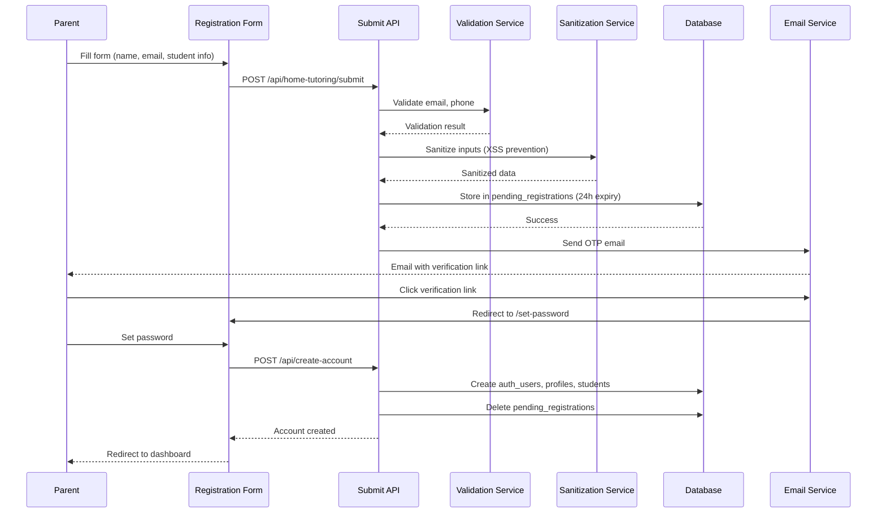

## Overview

Tutor-Link is a web platform that connects parents and guardians with qualified tutors for in-home tutoring, with future plans for tutor dashboards, admin views, and messaging. Within that broader vision, the parent signup and home-tutoring request workflow is the first fully implemented end-to-end journey.

This workflow allows a parent or guardian to describe a child’s tutoring needs, verify an email address through Supabase’s OTP flow, and create an account that stores both the parent profile and the initial home-tutoring request in the database. This document explains that workflow at a **conceptual level**, without focusing on code details. It shows how the browser, API routes, and Supabase work together, and how data moves from a form on the screen into the tables that back the platform.

## User roles and goals

- **Parent or guardian**
  - Wants to find a qualified tutor who can come to the home and teach a child.
  - Needs a straightforward way to:
    - Enter contact details.
    - Describe the student and learning needs.
    - State preferred subjects, schedule, and location.
    - Confirm that the email address is valid and can receive messages.

- **Tutor-Link platform**
  - Needs to capture a complete, structured tutoring request that can later be matched to tutors.
  - Must ensure that the parent’s email address is verified before creating a usable account.
  - Must store the parent, student, and request data safely in the database so that future features (matching, scheduling, dashboards) can rely on it.

## High-level architecture for this workflow

At a high level, the parent signup and home-tutoring request workflow is built from three main layers:

- **Frontend (browser + Next.js pages)**
  - Renders the home-tutoring form (`/home-tutoring`), the verification loading screen (`/auth/callback`), and the set-password page (`/set-password`).
  - Handles user interactions such as typing into fields, submitting the form, and setting a password.
  - Sends JSON requests to backend API routes and reacts to success or error responses.

- **Backend API routes (Next.js App Router)**
  - `/api/home-tutoring/submit` receives the form data, validates and sanitizes it, checks CSRF and rate limits, stores a pending registration, and asks Supabase to send the OTP email.
  - `/api/create-account` runs after the parent has verified the email and set a password. It reads the pending registration, creates the parent account and related records, and cleans up the temporary data.

- **Supabase (Auth + PostgreSQL database)**
  - Supabase Auth sends OTP / magic link emails and manages the underlying auth session.
  - The PostgreSQL database stores:
    - Temporary data in `pending_registrations` while the email has not yet been fully verified.
    - Permanent data in tables such as `auth_users`, `profiles`, `students`, and `home_tutoring_requests` once the account is created.

## Step-by-step conceptual flow

The following steps describe what happens conceptually from the moment a parent visits the site until the tutoring request is stored:

1. **Parent opens the home-tutoring page**
   - The `/home-tutoring` page loads in the browser and shows a form requesting parent details, student information, and tutoring requirements.

2. **Parent fills in the form and submits**
   - The parent enters their contact details, student details, subjects, preferred schedule, and location.
   - The frontend collects this data and includes a CSRF token to protect against cross-site request forgery.

3. **Frontend sends data to the submit API**
   - The browser sends a JSON request to `POST /api/home-tutoring/submit` with the form data and CSRF token.

4. **Backend validates, sanitizes, and rate limits**
   - The submit API checks:
     - That the request comes from an allowed origin.
     - That the CSRF token and signature are valid.
     - That the email, phone number, and country code are valid.
     - That the same email has not made too many recent requests.
   - The input is sanitized so that unsafe characters are cleaned before being stored or used.

5. **Backend stores a pending registration**
   - If all checks pass, the API stores the sanitized data in the `pending_registrations` table with an expiration time (for example, 24 hours).

6. **Supabase sends an OTP / magic link**
   - Using Supabase Auth, the API asks Supabase to send a one-time link to the parent’s email address.
   - The parent sees a message telling them to check their email to continue.

7. **Parent verifies email and returns to Tutor-Link**
   - The parent clicks the link in the email.
   - Supabase verifies the email and redirects the browser back to Tutor-Link (for example, via `/auth/callback` and then `/set-password`).

8. **Parent sets a password**
   - On the `/set-password` page, the parent chooses a secure password and confirms it.
   - The frontend validates the password and then calls `POST /api/create-account` with the email and password.

9. **Backend creates permanent records**
   - The create-account API:
     - Reads the matching `pending_registrations` record.
     - Creates rows in the permanent tables (`auth_users`, `profiles`, `students`, `home_tutoring_requests`).
     - Deletes the pending registration record once everything is saved.

10. **Parent can log in and the request is ready for future features**
    - After account creation, the parent can log in using the new credentials.
    - The tutoring request now lives in the main database tables, ready to be used by future features such as tutor matching and dashboards.

## Key components involved

- **Home-tutoring page (`/home-tutoring`)**
  - Renders the multi-step form used to collect parent, student, and tutoring requirement data.
  - Contains the client-side submit logic that gathers form values and calls the submit API with a CSRF token.

- **Submit API (`/api/home-tutoring/submit`)**
  - Validates the request origin, CSRF token, and form data.
  - Applies rate limiting to avoid abuse.
  - Sanitizes the data and stores it as a pending registration in Supabase.
  - Triggers Supabase Auth to send the OTP / magic link email to the parent.

- **Auth callback page (`/auth/callback`)**
  - Handles the redirect from Supabase after the parent clicks the email link.
  - Uses Supabase to set the session and then moves the parent towards the password setup step.

- **Set password page (`/set-password`)**
  - Lets the parent choose a secure password.
  - Uses a dedicated hook to validate the password and send a request to `/api/create-account`.
  - Shows feedback for loading, errors, and success.

- **Create-account API (`/api/create-account`)**
  - Looks up the pending registration data based on the email.
  - Creates permanent records in the auth and domain tables.
  - Cleans up the pending record once the account and tutoring request have been stored.

- **Registration storage helpers (`lib/registration-storage`)**
  - Provide small, focused functions for reading, writing, and deleting `pending_registrations` entries.
  - Hide the raw database queries behind a simple interface so that the rest of the code can focus on business logic.

## Conceptual data flow diagram

The following sequence diagram shows how data moves through the system during the parent signup and home-tutoring request workflow, from the parent filling in the form to the account and tutoring request being created:

This diagram is intentionally high level: it focuses on the main steps and which part of the system is responsible for each one, rather than every detail of the implementation.

## Design decisions and trade-offs

Several key design decisions shape how the parent signup workflow works:

- **Use Supabase OTP for email verification**
  - Instead of building a custom email verification flow, the system delegates email sending and token handling to Supabase Auth.
  - This reduces security risk and development time, but means the platform follows Supabase’s OTP and callback patterns.

- **Store registration data as “pending” before creating the account**
  - Registration details are first stored in `pending_registrations` and only moved into permanent tables after the email is verified and a password is set.
  - This avoids creating half-finished accounts for unverified or abandoned signups, at the cost of an extra step and an extra table.

- **Split the flow into two main API endpoints**
  - `/api/home-tutoring/submit` handles validation, CSRF, rate limiting, and temporary storage.
  - `/api/create-account` is called only after verification and focuses on creating permanent records.
  - This separation keeps each endpoint focused and testable, but introduces more moving parts that must stay in sync.

- **Use shared service modules for cross-cutting concerns**
  - Input sanitization, CSRF validation, rate limiting, and registration storage are placed in shared utilities under `lib/` instead of being duplicated in each route.
  - This encourages consistent behaviour across endpoints, but also means contributors need to understand these shared helpers when making changes.

## Limitations and future improvements

The current implementation of the parent signup workflow is intentionally scoped and has a few known limitations:

- **Limited explanation of follow-up requests**
  - During signup, the flow captures tutoring needs for a single child, but after login a parent can create additional home-tutoring requests from the dashboard. The current UI and copy do not clearly explain this capability, which may leave parents thinking they are limited to a single request.

- **CSRF protection only on the main signup form**
  - Strong CSRF protection is applied to the main home-tutoring request submission API, but other forms in the parent workflow do not yet use the same CSRF mechanisms. Extending CSRF protection to all state-changing forms would make the overall workflow more consistent and secure.

- **Limited feedback during the OTP and callback stages**
  - During the OTP and callback stages, the workflow uses simple, generic error messages. This is a deliberate security choice to avoid leaking information about whether an email address exists or why verification failed, but it also means the user experience can feel basic. There is room to add clearer generic messages and better server-side logging without exposing sensitive internal details.

- **Basic dashboards and manual matching only**
  - The admin dashboard provides a basic view of requests and supports manual matching, but many dashboard features are still minimal or incomplete. The planned matching algorithm, which will automatically filter tutors that meet a particular parent request, is not yet implemented and remains part of the future roadmap.

These limitations are deliberate trade-offs to keep the core parent signup workflow small, understandable, and testable while leaving room for the platform to grow in future iterations.

