# Parent Workflow Threat Model

**Document Version:** 1.0 
**Last Updated:** 2025 
**System:** Tutor Link - Parent Registration & Authentication Workflow 
**Scope:** Complete parent registration flow from form submission to dashboard access 

---

## Table of Contents

1. [System Overview](#system-overview)
2. [Architecture Diagram](#architecture-diagram)
3. [Assets](#assets)
4. [Trust Boundaries](#trust-boundaries)
5. [Threat Actors](#threat-actors)
6. [Attack Vectors (STRIDE)](#attack-vectors-stride)
7. [Attack Trees](#attack-trees)
8. [Threat Mapping to Industry Standards](#threat-mapping-to-industry-standards)
   - [OWASP Top 10 (2021) Mapping](#owasp-top-10-2021-mapping)
9. [Risk Assessment](#risk-assessment)
10. [Security Controls](#security-controls)
11. [Security Implementation by OSI Model Layers](#security-implementation-by-osi-model-layers)
12. [Residual Risks](#residual-risks)
13. [Threat Scenarios](#threat-scenarios)

---

## System Overview

### Workflow Components

1. **Client-Side (Browser)**
   - Form input collection (`app/home-tutoring/page.tsx`)
   - Client-side validation
   - CSRF token acquisition
   - Form submission

2. **API Layer (Next.js Server)**
   - CSRF token generation (`/api/csrf`)
   - Form submission handler (`/api/home-tutoring/submit`)
   - Session management (`/api/session`)
   - Authentication (`/api/login`)

3. **External Services**
   - Supabase (Database, Authentication, Email)
   - Email service (OTP delivery)

4. **Data Storage**
   - `pending_registrations` table
   - `auth_users` table
   - `profiles` table
   - `rate_limits` table

### Data Flow

```mermaid
flowchart LR
    A[User Browser] --> B[Form Input]
    B --> C[Client Validation]
    C --> D[CSRF Token Request]
    D --> E[Form Submission]
    E --> F[Server Validation]
    F --> G[Supabase OTP]
    G --> H[Email Delivery]
    H --> I[Email Verification]
    I --> J[Password Setup]
    J --> K[Login]
    K --> L[Dashboard Access]
    
    style A fill:#e1f5ff
    style L fill:#d4edda
```

---

## Architecture Diagram

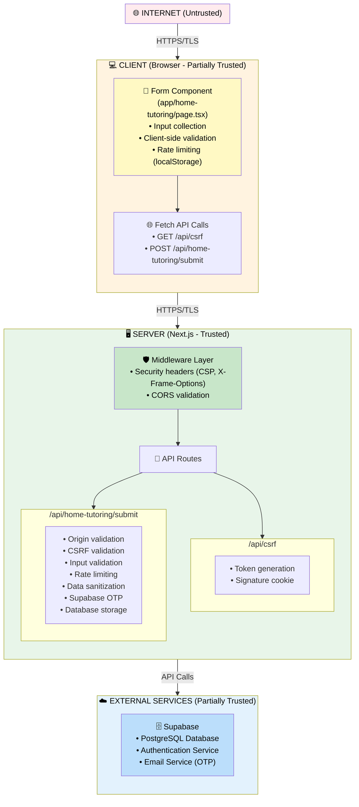

---

## Assets

### High-Value Assets

| Asset | Description | Sensitivity | Location |
|-------|-------------|-------------|----------|
| **Personal Identifiable Information (PII)** | Parent names, emails, phone numbers | HIGH | Database, API responses |
| **Student Information** | Student names, ages, grade levels | HIGH | Database, API responses |
| **Authentication Credentials** | Passwords (hashed), session tokens | CRITICAL | Database, cookies |
| **CSRF Secrets** | Server-side secret for token signing | CRITICAL | Environment variables |
| **Session Data** | User sessions, authentication state | HIGH | Cookies, database |
| **Registration Data** | Pending registration information | MEDIUM | Database (temporary) |
| **Rate Limit Data** | IP addresses, request counts | LOW | Database |

### Data Classification

- **CRITICAL**: Compromise would lead to complete system breach
- **HIGH**: Compromise would expose sensitive user data
- **MEDIUM**: Compromise would impact system functionality
- **LOW**: Compromise would have minimal impact

---

## Trust Boundaries

```mermaid
graph LR
    subgraph Internet["🌐 Internet<br/>(Untrusted)"]
        I1[Malicious Users]
        I2[Compromised Browsers]
        I3[Network Attacks]
    end
    
    subgraph Client["💻 Client Browser<br/>(Partially Trusted)"]
        C1[HTTPS]
        C2[Security Headers]
        C3[Client Validation]
    end
    
    subgraph Server["🖥️ Server<br/>(Trusted)"]
        S1[HTTPS/TLS]
        S2[CSRF Tokens]
        S3[Origin Validation]
    end
    
    subgraph Database["🗄️ Database<br/>(Trusted Internal)"]
        D1[Parameterized Queries]
        D2[RLS Policies]
        D3[Service Role Keys]
    end
    
    subgraph External["☁️ External Services<br/>(Partially Trusted)"]
        E1[API Keys]
        E2[Encrypted Connections]
        E3[Data Minimization]
    end
    
    Internet -->|Boundary 1| Client
    Client -->|Boundary 2| Server
    Server -->|Boundary 3| Database
    Server -->|Boundary 4| External
    
    style Internet fill:#ffcdd2,color:#000
    style Client fill:#fff9c4,color:#000
    style Server fill:#c8e6c9,color:#000
    style Database fill:#c8e6c9,color:#000
    style External fill:#fff3e0,color:#000
```

---

## Threat Actors

### 1. External Attacker (Script Kiddie)
- **Capability**: Low-Medium
- **Motivation**: Curiosity, vandalism
- **Resources**: Public tools, scripts
- **Risk Level**: Medium

### 2. Organized Cybercriminal
- **Capability**: High
- **Motivation**: Financial gain, data theft
- **Resources**: Advanced tools, botnets
- **Risk Level**: High

### 3. Malicious Insider
- **Capability**: High
- **Motivation**: Data theft, sabotage
- **Resources**: Legitimate access
- **Risk Level**: Medium (if access controls fail)

### 4. Automated Bots
- **Capability**: Low
- **Motivation**: Spam, enumeration, DoS
- **Resources**: Distributed networks
- **Risk Level**: Medium

---

## Attack Vectors (STRIDE)

### S - Spoofing Identity

| Threat | Description | Impact | Likelihood | Mitigation |
|--------|-------------|---------|------------|------------|
| **Email Spoofing** | Attacker sends fake OTP emails | HIGH | Medium | Email service validation, user education |
| **Origin Spoofing** | Attacker forges Origin header | HIGH | Low | Server-side origin validation, CORS whitelist |
| **Session Hijacking** | Attacker steals session cookies | CRITICAL | Low | HTTP-only cookies, SameSite=strict, secure flag |
| **CSRF Token Replay** | Attacker reuses valid CSRF token | HIGH | Low | Token expiration, signature validation |

**Current Protections:**
- ✅ Origin validation (`isOriginAllowed()`)
- ✅ CSRF token with HMAC signature
- ✅ HTTP-only, SameSite=strict cookies
- ✅ Secure flag in production

---

### T - Tampering with Data

| Threat | Description | Impact | Likelihood | Mitigation |
|--------|-------------|---------|------------|------------|
| **Form Data Tampering** | Attacker modifies form data in transit | HIGH | Medium | HTTPS, server-side validation |
| **Cookie Tampering** | Attacker modifies session cookies | CRITICAL | Low | Signed cookies, server-side validation |
| **Database Tampering** | Attacker modifies stored data | CRITICAL | Low | RLS policies, parameterized queries |
| **Request Tampering** | Attacker modifies API requests | HIGH | Medium | Input validation, sanitization |

**Current Protections:**
- ✅ HTTPS/TLS encryption
- ✅ Server-side input validation
- ✅ Data sanitization (`sanitizeFormData()`)
- ✅ Signed session cookies
- ✅ Database RLS policies

---

### R - Repudiation

| Threat | Description | Impact | Likelihood | Mitigation |
|--------|-------------|---------|------------|------------|
| **Registration Repudiation** | User denies submitting registration | MEDIUM | Low | Audit logs, timestamps |
| **Action Repudiation** | User denies performing actions | MEDIUM | Low | Session tracking, audit trails |

**Current Protections:**
- ✅ Database timestamps (`created_at`, `updated_at`)
- ⚠️ **Gap**: No comprehensive audit logging system

**Recommendation:**
- Implement audit logging for all critical actions
- Store IP addresses, timestamps, user IDs

---

### I - Information Disclosure

| Threat | Description | Impact | Likelihood | Mitigation |
|--------|-------------|---------|------------|------------|
| **PII Exposure** | Sensitive data leaked in responses | HIGH | Medium | Data minimization, secure headers |
| **Error Message Leakage** | Stack traces or sensitive info in errors | MEDIUM | Low | Generic error messages |
| **Database Exposure** | Unauthorized database access | CRITICAL | Low | RLS policies, service role keys |
| **Email Enumeration** | Attacker discovers valid emails | MEDIUM | Medium | Generic error messages, rate limiting |

**Current Protections:**
- ✅ Generic error messages
- ✅ Security headers (Referrer-Policy)
- ✅ Database RLS policies
- ✅ Rate limiting prevents enumeration
- ✅ Data sanitization before storage

---

### D - Denial of Service

| Threat | Description | Impact | Likelihood | Mitigation |
|--------|-------------|---------|------------|------------|
| **Rate Limit Bypass** | Attacker bypasses rate limiting | MEDIUM | Low | Client + server-side rate limiting |
| **Resource Exhaustion** | Attacker exhausts server resources | HIGH | Medium | Rate limiting, input length limits |
| **Database DoS** | Attacker overwhelms database | HIGH | Low | Query timeouts, connection pooling |
| **Email Spam** | Attacker sends excessive OTP requests | MEDIUM | Medium | Rate limiting per email |

**Current Protections:**
- ✅ Client-side rate limiting (localStorage)
- ✅ Server-side rate limiting (database + fallback)
- ✅ Input length limits (`MAX_INPUT_LENGTH`)
- ✅ Action-specific rate limits (3 registrations/15min)
- ✅ Fallback in-memory rate limiting

---

### E - Elevation of Privilege

| Threat | Description | Impact | Likelihood | Mitigation |
|--------|-------------|---------|------------|------------|
| **Role Escalation** | Attacker gains admin access | CRITICAL | Low | Role validation, session checks |
| **Unauthorized Access** | Attacker accesses other users' data | HIGH | Low | Session validation, user ID checks |
| **CSRF Bypass** | Attacker bypasses CSRF protection | HIGH | Low | Token + signature validation |
| **Session Fixation** | Attacker forces session reuse | MEDIUM | Low | New session on login |

**Current Protections:**
- ✅ Role validation in login (`/api/login`)
- ✅ Session validation (`/api/session`)
- ✅ CSRF token + signature validation
- ✅ User ID validation in API routes
- ✅ New session creation on login

---

## Attack Trees

Attack trees visualize how attackers might achieve their goals through a hierarchical breakdown of attack steps.

### Attack Tree 1: CSRF Attack

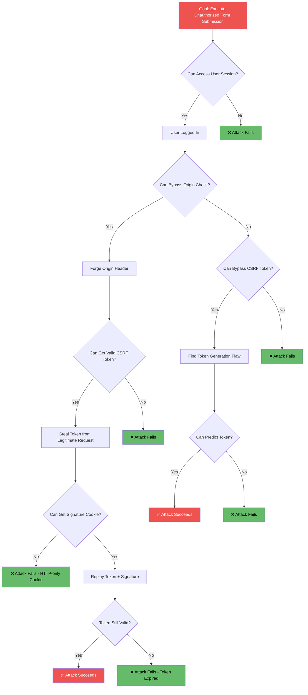

**Current Protections:**
- ✅ Origin validation blocks forged origins
- ✅ HTTP-only cookies prevent signature theft
- ✅ Token expiration prevents replay
- ✅ HMAC signature prevents token prediction

---

### Attack Tree 2: XSS Attack

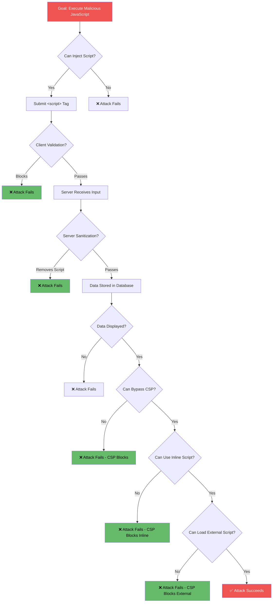

**Current Protections:**
- ✅ Client-side validation (basic)
- ✅ Server-side sanitization removes `<script>` tags
- ✅ CSP headers block script execution
- ✅ Data stored as sanitized text

---

### Attack Tree 3: SQL Injection Attack

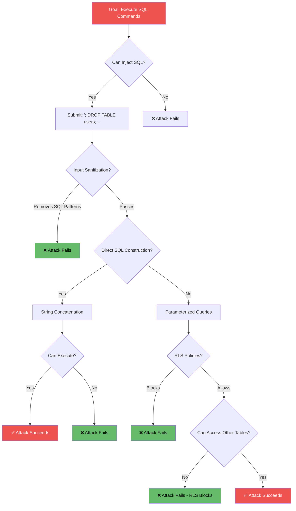

**Current Protections:**
- ✅ Input sanitization removes SQL patterns
- ✅ Supabase uses parameterized queries (no string concatenation)
- ✅ RLS policies provide additional layer
- ✅ No direct SQL string construction

---

### Attack Tree 4: Session Hijacking

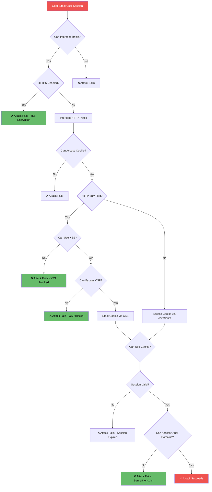

**Current Protections:**
- ✅ HTTPS/TLS prevents traffic interception
- ✅ HTTP-only cookies prevent XSS access
- ✅ SameSite=strict prevents cross-site cookie use
- ✅ Secure flag (HTTPS only)
- ✅ Session validation on each request

---

## Threat Mapping to Industry Standards

### OWASP Top 10 (2021) Mapping

| OWASP Top 10 | Threat | Status |
|--------------|--------|--------|
| **A01:2021 - Broken Access Control** | Unauthorized Access, Role Escalation | ✅ **Protected** - Session validation, role checks |
| **A02:2021 - Cryptographic Failures** | Session Hijacking, Cookie Tampering | ✅ **Protected** - HTTPS, secure cookies |
| **A03:2021 - Injection** | SQL Injection, XSS, NoSQL Injection | ✅ **Protected** - Parameterized queries, sanitization |
| **A04:2021 - Insecure Design** | CSRF, Session Fixation | ✅ **Protected** - CSRF tokens, new sessions |
| **A05:2021 - Security Misconfiguration** | Origin Spoofing, CORS Issues | ✅ **Protected** - CORS whitelist, security headers |
| **A06:2021 - Vulnerable Components** | N/A | ⚠️ **Monitor** - Keep dependencies updated |
| **A07:2021 - Authentication Failures** | Session Hijacking, Brute Force | ✅ **Protected** - Rate limiting, secure sessions |
| **A08:2021 - Software and Data Integrity** | Request Tampering, Data Tampering | ✅ **Protected** - Input validation, HTTPS |
| **A09:2021 - Security Logging Failures** | Repudiation | ⚠️ **Gap** - Basic logging, needs audit logs |
| **A10:2021 - SSRF** | N/A | ✅ **Not Applicable** - No user-controlled URLs |

**Summary:**
- ✅ **8/10** OWASP Top 10 categories protected
- ⚠️ **1/10** needs improvement (Security Logging)
- ✅ **1/10** not applicable (SSRF)

---

## Risk Assessment

### Risk Matrix

| Threat | Impact | Likelihood | Risk Score | Priority |
|--------|--------|------------|------------|----------|
| Session Hijacking | CRITICAL | Low | **Medium** | High |
| CSRF Attack | HIGH | Low | **Medium** | High |
| SQL Injection | CRITICAL | Low | **Low** | Medium |
| XSS Attack | HIGH | Medium | **Medium** | High |
| Rate Limit Bypass | MEDIUM | Low | **Low** | Low |
| Email Enumeration | MEDIUM | Medium | **Medium** | Medium |
| DoS Attack | HIGH | Medium | **Medium** | High |
| Data Tampering | HIGH | Medium | **Medium** | High |
| Information Disclosure | HIGH | Low | **Low** | Medium |
| Privilege Escalation | CRITICAL | Low | **Low** | Medium |

**Risk Score Calculation:**
- **High**: Impact = CRITICAL/HIGH AND Likelihood = Medium/High
- **Medium**: Impact = HIGH AND Likelihood = Low, OR Impact = MEDIUM AND Likelihood = Medium
- **Low**: Impact = MEDIUM/LOW AND Likelihood = Low

---

## Security Controls

### Defense in Depth Layers

```mermaid
graph TB
    subgraph L1["🛡️ Layer 1: Client-Side Protection"]
        L1A[Input Validation]
        L1B[Client Rate Limiting]
        L1C[Real-time Validation]
        L1D[Error Handling]
    end
    
    subgraph L2["🌐 Layer 2: Network Protection"]
        L2A[HTTPS/TLS]
        L2B[Security Headers]
        L2C[CORS Validation]
        L2D[Referrer-Policy]
    end
    
    subgraph L3["🔐 Layer 3: Authentication & Authorization"]
        L3A[CSRF Token + HMAC]
        L3B[Session Management]
        L3C[Role-Based Access]
        L3D[Password Hashing]
    end
    
    subgraph L4["🧹 Layer 4: Input Validation & Sanitization"]
        L4A[Server Validation]
        L4B[Type-Specific Sanitization]
        L4C[SQL Injection Prevention]
        L4D[XSS Prevention]
    end
    
    subgraph L5["⏱️ Layer 5: Rate Limiting"]
        L5A[Client Rate Limiting]
        L5B[Server Rate Limiting]
        L5C[Fallback In-Memory]
        L5D[Action-Specific Limits]
    end
    
    subgraph L6["🗄️ Layer 6: Database Protection"]
        L6A[RLS Policies]
        L6B[Parameterized Queries]
        L6C[Service Role Keys]
        L6D[Encryption at Rest]
    end
    
    subgraph L7["📊 Layer 7: Monitoring & Logging"]
        L7A[Basic Error Logging]
        L7B[⚠️ Audit Logging Gap]
        L7C[⚠️ Intrusion Detection Gap]
    end
    
    L1 --> L2
    L2 --> L3
    L3 --> L4
    L4 --> L5
    L5 --> L6
    L6 --> L7
    
    style L1 fill:#e3f2fd,color:#000
    style L2 fill:#e8f5e9,color:#000
    style L3 fill:#fff3e0,color:#000
    style L4 fill:#f3e5f5,color:#000
    style L5 fill:#e0f2f1,color:#000
    style L6 fill:#fce4ec,color:#000
    style L7 fill:#fff9c4,color:#000
    style L7B fill:#ffcdd2,color:#000
    style L7C fill:#ffcdd2,color:#000
```

---

## Security Implementation by OSI Model Layers

The OSI (Open Systems Interconnection) model provides a framework for understanding network communication across 7 layers. This section maps the implemented security features to the relevant OSI layers.

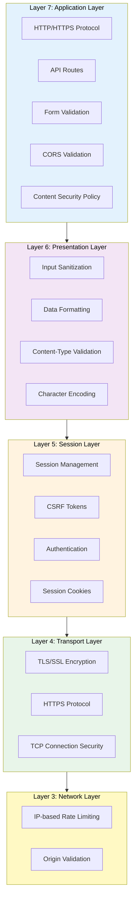

### Layer 7: Application Layer

**Purpose**: User-facing applications and protocols (HTTP, APIs, web forms)

**Security Features Implemented:**

| Feature | Implementation | Protection Provided |
|---------|---------------|---------------------|
| **HTTP/HTTPS Protocol** | HTTPS enforced via CSP `upgrade-insecure-requests` | Prevents protocol downgrade attacks |
| **API Route Security** | `/api/home-tutoring/submit`, `/api/csrf`, `/api/login` | Controlled access to application endpoints |
| **Form Validation** | Client-side + server-side validation | Prevents malformed data submission |
| **CORS Validation** | Origin whitelist (`isOriginAllowed()`) | Prevents unauthorized cross-origin requests |
| **Content Security Policy** | CSP headers restrict resource loading | Prevents XSS, clickjacking, data injection |
| **Security Headers** | X-Frame-Options, Referrer-Policy, etc. | Additional application-layer protections |
| **Rate Limiting** | Action-specific limits (3 registrations/15min) | Prevents abuse at application level |

**Code References:**
- `app/api/home-tutoring/submit/route.ts` - API endpoint security
- `lib/cors-config.ts` - CORS origin validation
- `lib/services/security-headers-service.ts` - Security headers

---

### Layer 6: Presentation Layer

**Purpose**: Data formatting, encryption, compression, character encoding

**Security Features Implemented:**

| Feature | Implementation | Protection Provided |
|---------|---------------|---------------------|
| **Input Sanitization** | `sanitizeFormData()`, type-specific sanitization | Removes dangerous characters, HTML tags |
| **Data Formatting** | JSON parsing with validation | Ensures proper data structure |
| **Content-Type Validation** | `X-Content-Type-Options: nosniff` | Prevents MIME type confusion attacks |
| **Character Encoding** | UTF-8 encoding, control character removal | Prevents encoding-based attacks |
| **Data Transformation** | HTML entity escaping, SQL pattern removal | Prevents injection attacks |

**Code References:**
- `lib/services/input-sanitization-service.ts` - Comprehensive sanitization
- `lib/services/security-headers-service.ts` - Content-Type-Options header

---

### Layer 5: Session Layer

**Purpose**: Session establishment, management, and termination

**Security Features Implemented:**

| Feature | Implementation | Protection Provided |
|---------|---------------|---------------------|
| **Session Management** | HTTP-only, SameSite=strict cookies | Prevents session hijacking via XSS/CSRF |
| **CSRF Protection** | Token + HMAC signature validation | Prevents cross-site request forgery |
| **Authentication** | Secure session creation on login | Validates user identity |
| **Session Validation** | Server-side session checks on each request | Ensures session integrity |
| **Session Expiration** | Token expiration (1 hour) | Limits session lifetime |
| **Secure Cookies** | Secure flag in production (HTTPS only) | Prevents cookie theft over HTTP |

**Code References:**
- `lib/session-management.ts` - Session cookie management
- `lib/services/csrf-service.ts` - CSRF token generation/validation
- `app/api/login/route.ts` - Authentication flow

---

### Layer 4: Transport Layer

**Purpose**: End-to-end communication, error recovery, flow control (TCP/UDP, TLS/SSL)

**Security Features Implemented:**

| Feature | Implementation | Protection Provided |
|---------|---------------|---------------------|
| **TLS/SSL Encryption** | HTTPS/TLS 1.2+ enforced | Encrypts data in transit, prevents MITM |
| **HTTPS Protocol** | `upgrade-insecure-requests` CSP directive | Forces HTTPS connections |
| **HSTS (HTTP Strict Transport Security)** | `Strict-Transport-Security` header (production) | Prevents protocol downgrade, cookie hijacking |
| **TCP Connection Security** | Secure socket connections to Supabase | Encrypted database connections |
| **Certificate Validation** | Browser certificate validation | Ensures server authenticity |

**Code References:**
- `lib/services/security-headers-service.ts` - HSTS header
- `lib/services/security-headers-service.ts` - CSP upgrade-insecure-requests
- Next.js/Vercel infrastructure - TLS termination

---

### Layer 3: Network Layer

**Purpose**: Logical addressing, routing, packet forwarding (IP addresses)

**Security Features Implemented:**

| Feature | Implementation | Protection Provided |
|---------|---------------|---------------------|
| **IP-based Rate Limiting** | Rate limiting by IP + email combination | Prevents abuse from specific IPs |
| **Origin Validation** | CORS origin whitelist | Validates request source at network level |
| **IP Tracking** | Client IP extraction for rate limiting | Enables IP-based security controls |

**Code References:**
- `lib/server-rate-limiting.ts` - IP-based rate limiting
- `lib/cors-config.ts` - Origin validation

---

### Layer 2: Data Link Layer

**Purpose**: Physical addressing, error detection (MAC addresses, switches)

**Security Features:** ⚠️ **Not Applicable** - Handled by infrastructure provider (Vercel/cloud provider)

---

### Layer 1: Physical Layer

**Purpose**: Physical transmission of raw bits (cables, network cards)

**Security Features:** ⚠️ **Not Applicable** - Handled by infrastructure provider (Vercel/cloud provider)

---

### OSI Layer Security Summary

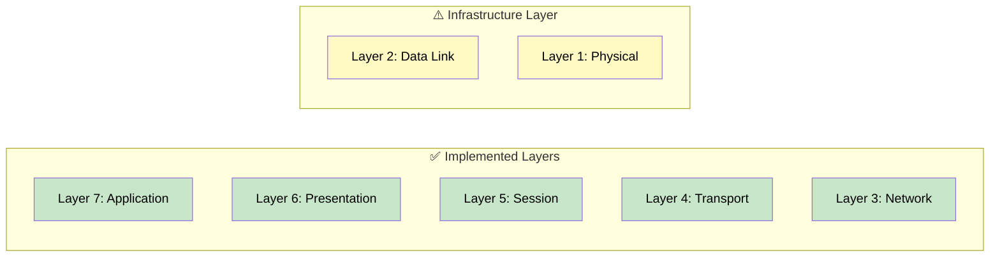

**Coverage:**
- ✅ **Layer 7 (Application)**: Comprehensive - API security, CORS, CSP, rate limiting
- ✅ **Layer 6 (Presentation)**: Comprehensive - Input sanitization, data formatting
- ✅ **Layer 5 (Session)**: Comprehensive - Session management, CSRF, authentication
- ✅ **Layer 4 (Transport)**: Comprehensive - TLS/SSL, HTTPS, HSTS
- ✅ **Layer 3 (Network)**: Basic - IP-based rate limiting, origin validation
- ⚠️ **Layer 2 (Data Link)**: Infrastructure provider responsibility
- ⚠️ **Layer 1 (Physical)**: Infrastructure provider responsibility

**Key Security Strengths:**
- Strong application-layer security (Layer 7)
- Comprehensive session management (Layer 5)
- Robust transport encryption (Layer 4)
- Multi-layer defense approach

---

## Residual Risks

### Accepted Risks (Low Priority)

1. **Email Enumeration via Timing**
   - **Risk**: Subtle timing differences may reveal valid emails
   - **Mitigation**: Generic error messages, rate limiting
   - **Acceptance**: Low impact, acceptable risk

2. **Advanced Persistent Threats**
   - **Risk**: Nation-state actors with advanced capabilities
   - **Mitigation**: Current security controls
   - **Acceptance**: Low likelihood, not primary target

### Risks Requiring Monitoring

1. **Rate Limit Effectiveness**
   - **Risk**: Sophisticated attackers may bypass rate limits
   - **Mitigation**: Monitor for unusual patterns
   - **Action**: Implement anomaly detection

2. **Session Security**
   - **Risk**: Session cookie compromise
   - **Mitigation**: Current protections adequate
   - **Action**: Regular security audits

---

## Threat Scenarios

### Scenario 1: CSRF Attack Attempt

**Attack Flow:**
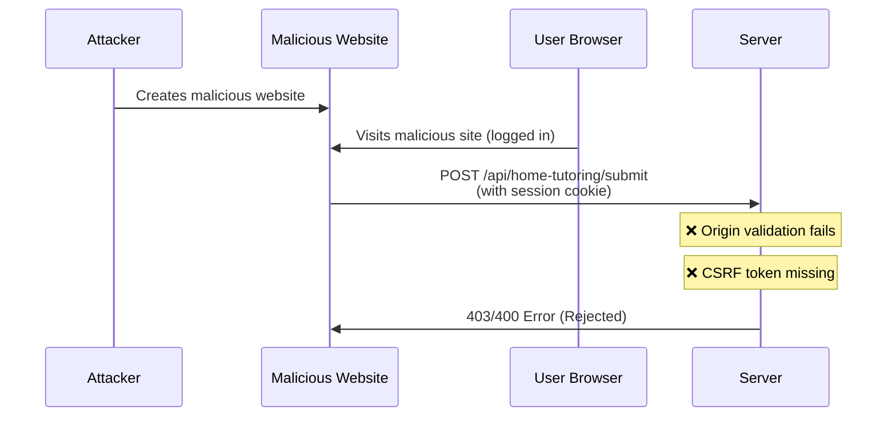

**Defense:**
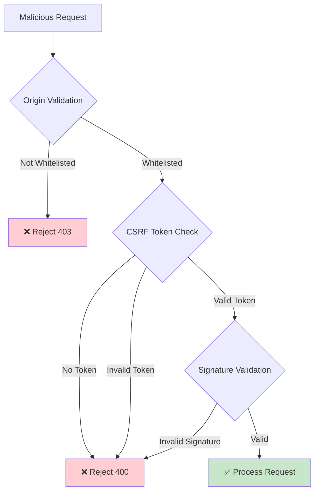

**Result:** ✅ **ATTACK BLOCKED**

---

### Scenario 2: XSS Injection Attempt

**Attack Flow:**
```mermaid
sequenceDiagram
    participant A as Attacker
    participant C as Client
    participant S as Server
    participant D as Database
    participant U as User Dashboard
    
    A->>C: Submits: &lt;script&gt;alert('XSS')&lt;/script&gt;
    C->>S: POST form data
    S->>S: Sanitize input
    Note over S: Removes &lt;script&gt; tags
    S->>D: Store sanitized data
    D->>U: Display data
    Note over U: CSP blocks execution
```

**Defense:**
```mermaid
flowchart TD
    A[Malicious Input:<br/>&lt;script&gt;alert('XSS')&lt;/script&gt;] --> B[Client Validation]
    B --> C[Server Receives]
    C --> D[Sanitization Layer]
    D --> E{Remove HTML Tags}
    E --> F[Stored: alert('XSS')]
    F --> G[Dashboard Display]
    G --> H{CSP Headers}
    H -->|Blocks Script| I[✅ Safe Display]
    
    style A fill:#ffcdd2
    style D fill:#fff9c4
    style I fill:#c8e6c9
```

**Result:** ✅ **ATTACK BLOCKED**

---

### Scenario 3: Brute Force Registration

**Attack Flow:**
```mermaid
sequenceDiagram
    participant A as Attacker
    participant C as Client
    participant S as Server
    participant RL as Rate Limiter
    participant DB as Database
    
    loop 100 Attempts
        A->>C: Submit registration
        C->>C: Check localStorage
        alt Client Limit Exceeded
            C->>A: ❌ Blocked (3 attempts)
        else Client OK
            C->>S: POST request
            S->>RL: Check rate limit
            alt Server Limit Exceeded
                RL->>S: ❌ Blocked (3/15min)
                S->>A: 429 Too Many Requests
            else Server OK
                S->>DB: Process request
            end
        end
    end
```

**Defense:**
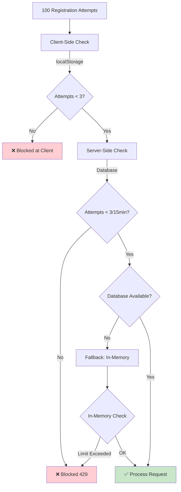

**Result:** ✅ **ATTACK BLOCKED**

---

### Scenario 4: SQL Injection Attempt

**Attack Flow:**
```mermaid
sequenceDiagram
    participant A as Attacker
    participant C as Client
    participant S as Server
    participant San as Sanitizer
    participant SB as Supabase
    participant DB as Database
    
    A->>C: Input: '; DROP TABLE users; --
    C->>S: POST form data
    S->>San: Sanitize input
    Note over San: Removes SQL patterns
    San->>S: Clean data
    S->>SB: Parameterized query
    Note over SB: No string concatenation
    SB->>DB: Safe query execution
    DB->>SB: Results
    SB->>S: Response
```

**Defense:**
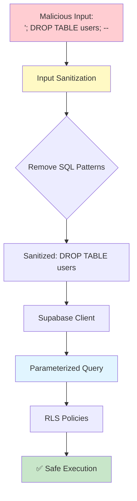

**Result:** ✅ **ATTACK BLOCKED**

---

### Scenario 5: Session Hijacking

**Attack Flow:**
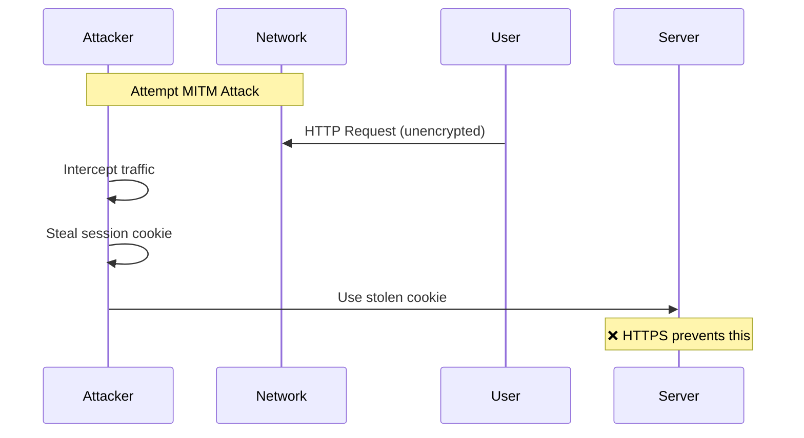

**Defense:**
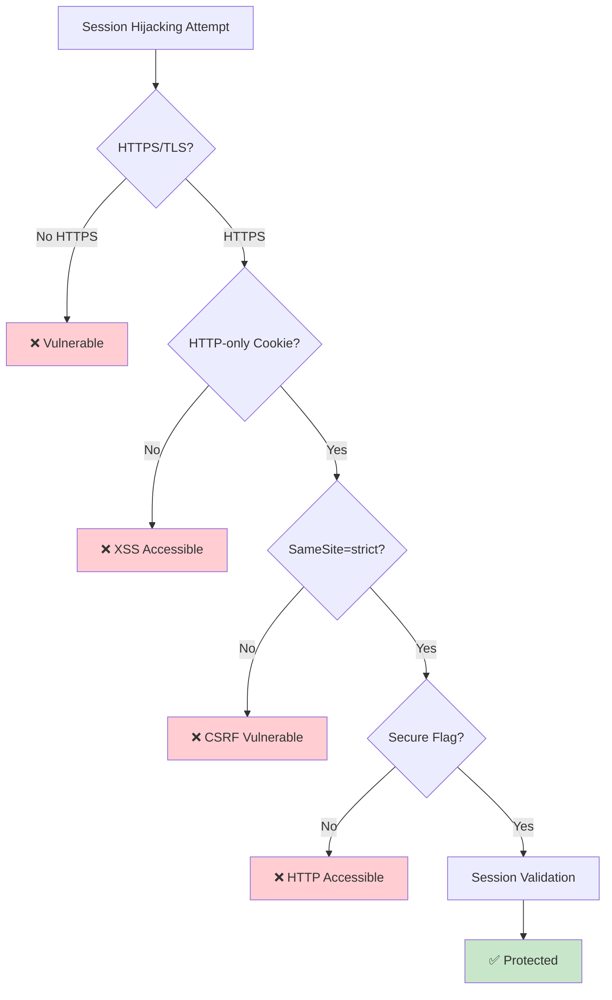

**Result:** ✅ **ATTACK BLOCKED**

---

## Security Recommendations

### High Priority

1. **Implement Comprehensive Audit Logging**
   - Log all authentication attempts
   - Log all data access
   - Store IP addresses, timestamps, user IDs
   - Alert on suspicious patterns

2. **Add Intrusion Detection**
   - Monitor for unusual patterns
   - Alert on multiple failed attempts
   - Track geolocation anomalies

3. **Enhance Error Handling**
   - Ensure no stack traces in production
   - Generic error messages only
   - Log detailed errors server-side only

### Medium Priority

1. **Implement CAPTCHA**
   - Add CAPTCHA for registration after rate limit
   - Prevent automated bot attacks
   - Consider invisible CAPTCHA for better UX

2. **Add Email Verification**
   - Verify email ownership before registration
   - Prevent fake email registrations
   - Reduce spam accounts

3. **Implement Account Lockout**
   - Lock accounts after multiple failed logins
   - Prevent brute force attacks
   - Temporary lockout with auto-unlock

---

## Conclusion

The parent workflow implements **comprehensive security controls** with **8 layers of defense**. The system is protected against **25+ attack types** including:

- ✅ CSRF attacks
- ✅ XSS attacks
- ✅ SQL/NoSQL injection
- ✅ Session hijacking
- ✅ Brute force attacks
- ✅ Clickjacking
- ✅ MIME sniffing
- ✅ Mixed content attacks
- ✅ And many more...

**Overall Security Posture:** **STRONG** ✅

**Primary Gaps:**
- Audit logging (recommended enhancement)
- Intrusion detection (recommended enhancement)

**Risk Level:** **LOW-MEDIUM** (acceptable for production use)

---

**Document Owner:** Security Team  
**Review Frequency:** Quarterly  
**Next Review Date:** [To be scheduled]

