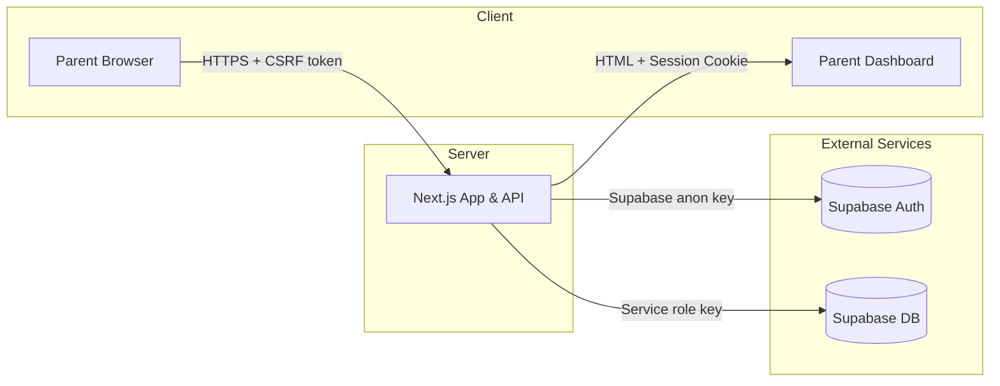

## Threat Model – Tutor-Link (Parent Signup & Account Creation)

### 1. Scope

This threat model focuses on the **parent signup and home-tutoring request workflow** in Tutor-Link. In scope are:

- The public **home-tutoring request form** (`/home-tutoring`)
- The **OTP-based email verification** via Supabase Auth (`/auth/callback`, `/set-password`)
- The **temporary registration storage** in the `pending_registrations` table
- The **account creation** logic in `/api/create-account` that promotes a pending registration to permanent records in `auth_users`, `profiles`, `students`, and `home_tutoring_requests`
- The basic **parent dashboard** that a newly created parent account can access

Other features (for example, tutor and admin dashboards, automated matching) are part of the platform’s broader design but are not fully implemented yet, so they are out of scope for this minimal threat model.

### 2. Assets

- **Parent and student data**
  - Parent contact details (name, email, phone, country code)
  - Student details (name, age, grade level)
  - Tutoring requirements (subjects, schedule, location, additional notes)
- **Authentication and session data**
  - Parent credentials (email and password, stored as a hash)
  - Supabase Auth sessions and access/refresh tokens
  - Application session cookies (`tutor_link_session`)
- **Application and infrastructure**
  - Supabase database tables (`pending_registrations`, `auth_users`, `profiles`, `students`, `home_tutoring_requests`)
  - Tutor-Link Next.js application and API routes

### 3. Threat Actors

- **External attackers**
  - Attempt to exploit public endpoints, steal accounts, or exfiltrate data.
- **Malicious users**
  - Create fake accounts, spam the signup form, or try to access data that does not belong to them.
- **Curious insiders**
  - Misuse elevated access (for example, admin dashboards) to access or modify data they should not see.

### 4. Trust Boundaries

The diagram below shows the main components involved in the parent signup workflow and the trust boundaries between them.

The main trust boundaries in the parent signup workflow are:

- **Browser ▸ Next.js App & API**
  - Untrusted user input from the browser is submitted to backend APIs such as `POST /api/home-tutoring/submit`.
  - Controls at this boundary:
    - HTTPS transport (via the hosting provider, e.g. Vercel).
    - Strict CORS configuration and origin checks (`lib/cors-config.ts`, `app/api/home-tutoring/submit/route.ts`).
    - CSRF protection using HMAC-signed tokens stored in `httpOnly` cookies (`lib/services/csrf-service.ts`, `lib/session-management.ts`).
    - Input validation and sanitisation (`lib/security.ts`, `lib/services/input-sanitization-service.ts`).
    - Server-side rate limiting for high-risk endpoints (`lib/server-rate-limiting.ts`).

- **Next.js App ▸ Supabase (Auth + Database)**
  - The backend calls Supabase using a **service role key** (`supabaseAdmin` in `lib/supabase.ts`) to create and read records in `pending_registrations`, `auth_users`, `profiles`, `students`, and `home_tutoring_requests`.
  - Controls at this boundary:
    - Service role key is only used server-side, never exposed to the browser.
    - Supabase enforces row-level security (RLS) for anonymous client access, preventing users from reading or writing other users’ data.
    - Data is sanitised and validated before being sent to Supabase.

- **Public area ▸ Authenticated parent session**
  - After OTP verification and password setup, the parent transitions from an unauthenticated state to an authenticated session.
  - Controls at this boundary:
    - Supabase Auth verifies the email address via OTP.
    - The application sets a signed `httpOnly`, `secure`, `sameSite=strict` session cookie (`lib/session-management.ts`).
    - Protected routes and APIs check for a valid session and user role before returning sensitive data.

### 5. Key Threats and Mitigations

This section summarises the most important threats within the scoped workflow and the measures implemented to address them.

#### 5.1 CSRF on the parent signup API

- **Threat**: An attacker tricks a parent into submitting the home-tutoring form from a malicious site, causing unintended registrations or account creation.
- **Mitigations**:
  - CSRF tokens are generated server-side, signed with `CSRF_SECRET`, and stored in an `httpOnly` cookie (`lib/services/csrf-service.ts`, `lib/session-management.ts`, `app/api/csrf/route.ts`).
  - The `POST /api/home-tutoring/submit` endpoint extracts and validates the CSRF token and signature before processing the form (`app/api/home-tutoring/submit/route.ts`).
  - `sameSite='strict'` and `secure` flags are set on session cookies to limit cross-site cookie usage (`lib/session-management.ts`).

#### 5.2 Injection and malicious input

- **Threat**: Attackers provide crafted input (for example, JavaScript or SQL-like payloads) via the home-tutoring form fields to execute code in the browser or manipulate database queries.
- **Mitigations**:
  - **Field-level validation** for email, phone number, grade level, and required fields is implemented in `lib/security.ts` and used in `app/home-tutoring/page.tsx` and `app/api/home-tutoring/submit/route.ts`.
  - **Input sanitisation** is applied before storing data in `pending_registrations` and other tables using `lib/services/input-sanitization-service.ts` (for example, removal of script tags, dangerous characters, and non-numeric input for numeric fields).
  - Database writes are performed via Supabase’s parameterised APIs (`lib/supabase.ts`, `lib/registration-storage.ts`), which reduces the risk of SQL injection.

#### 5.3 Abuse and brute-force attacks

- **Threat**: Attackers repeatedly submit the signup or login forms to discover valid accounts, send spam, or overload the system.
- **Mitigations**:
  - **Client-side rate limiting** in `app/home-tutoring/page.tsx` provides immediate feedback to the user and reduces unnecessary calls when they retry quickly.
  - **Server-side rate limiting** in `lib/server-rate-limiting.ts` enforces per-email and per-IP request limits for registration and authentication endpoints, returning HTTP 429 responses when limits are exceeded.
  - **Account lockout** for failed login attempts is handled by `lib/account-lockout.ts`, making brute-force attacks more difficult.

#### 5.4 Session hijacking and token theft

- **Threat**: An attacker tries to steal or forge a parent’s session token to access their account.
- **Mitigations**:
  - Sessions are stored in a signed, `httpOnly`, `secure`, `sameSite=strict` cookie (`lib/session-management.ts`), which prevents access from JavaScript and reduces the risk of CSRF and XSS-based token theft.
  - Tokens are signed with a secret (`SESSION_SECRET`) and verified using HMAC, so tampering with the cookie invalidates the session.
  - Security headers (for example, Content-Security-Policy, X-Frame-Options) are applied via `lib/services/security-headers-service.ts` to reduce the risk of XSS and clickjacking.

### 6. Residual Risks and Future Improvements

- **Broader CSRF coverage**: CSRF protections are currently focused on the main parent signup API. In the future, the same pattern should be extended to any other state-changing endpoints (for example, updating profile data, creating additional tutoring requests).
- **Richer monitoring and alerting**: While rate limiting and account lockout are implemented, there is not yet a dedicated monitoring or alerting system for unusual patterns (for example, spikes in failed logins).
- **Enhanced authentication options**: Multi-factor authentication (MFA) for parents and especially for admin users is not yet implemented, but would significantly strengthen protection against account takeover.
- **Expanded role-based access control**: The `role` field is present in `auth_users` and `profiles`, but fine-grained authorisation rules for different dashboards and actions can be expanded as more features are implemented.

